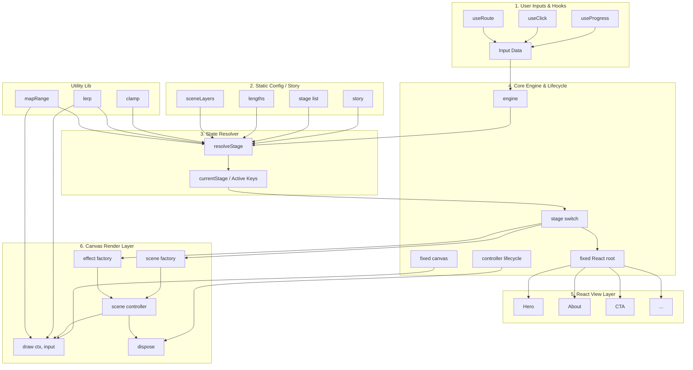
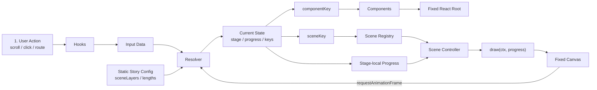
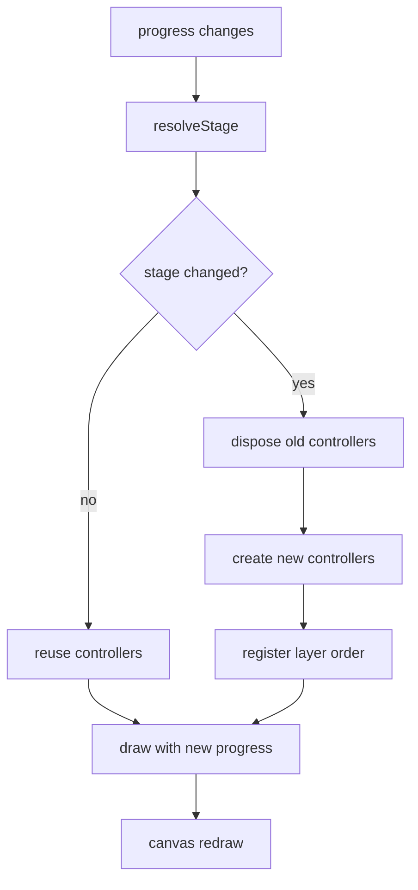
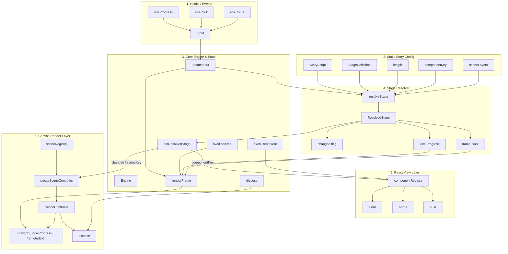

# attic.me Architecture

attic.me は一般的なランディングページではなく、スクロールや入力に応じて屋根裏部屋を探索する体験を作る。

> このファイルは概念図です。実装の基準は docs/skeletal-engine-reference.md を参照する。

## Core Ideas

- story は脚本である。
- stage は1つの場面を表すレシピである。
- resolver は input と story から currentStage を返す純粋関数である。
- engine は 1 個だけ存在する shared runtime で、固定の canvas を持ち、stage 切り替え時に controller だけを差し替える。
- scene は Canvas 2D の描画系であり、scene factory / controller factory として扱う。
- components は React UI 部品の置き場である。
- hooks は progress, click, route などの input を収集する。
- lib は純粋関数だけを置く。

## Data Flow

Input
- scroll progress
- click
- route change
- future events

Story
- stage の並び
- 遷移規則
- 表示順序

Resolver
- input と story を受け取る
- currentStage を返す

Engine
- 固定の canvas を持つ
  - React view layer と連携する
- stage ごとに controller を差し替える

Scene
  - sceneRegistry から描画 controller を生成する
- canvas を作り直さない

Components
  - componentRegistry から current component を描画する
- React UI だけを担当する

## Flow

- hooks が progress, click, route を収集する
- resolver が story と input から currentStage を返す
- engine が currentStage を受け取る
- stage の componentKey を使って React UI を描画する
- stage の sceneKey を使って canvas controller を取得する
- engine が同じ canvas に draw させる
- stage が変わった時だけ controller を差し替える

## Stage Structure

- id
- componentKey
- sceneKey
- sceneLayers
- length

## Constraints

- canvas は stage ごとに作り直さない。
- components tree も stage ごとに作り直さない。
- 切り替えるのは controller と state だけにする。
- story に描画ロジックを入れない。
- resolver に UI 描画を入れない。
- engine に stage の定義データを持ちすぎない。

## Controller Contract

- draw(ctx, input)
- dispose()

## Why This Shape

この構造にすると、LP だけでなく web app のチュートリアル、ログイン画面、世界観ページなどにも同じ考え方を再利用できる。  
また、stage を関数の入力と出力として扱えるため、React と Canvas を同じ脚本から同期させやすい。

## Risks

- engine が肥大化しやすいので、resolve と render の境界を保つ必要がある。
- stage に実体の component を持たせると、レシピより実装に寄りやすい。
- input 種類が増えると resolver の型が複雑になるので、input は union として整理する。
- canvas を複数生成すると切り替え時にカクつくので、1 枚固定を守る。

## Stability Rules

- canvas は 1 枚固定
- React root は 1 枚固定
- controller は stage 単位で交換
- progress は描画更新のトリガー
- same frameIndex なら再描画しない

## Sequence
### 全体図

### 実行ループ図

### ライフサイクル図

